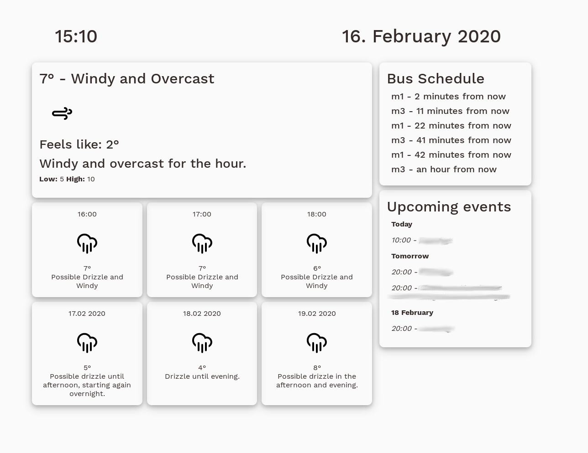

# DayDashboard

<!-- TABLE OF CONTENTS -->
## Table of Contents

* [DayDashboard](#daydashboard)
  * [Built With](#built-with)
* [Getting Started](#getting-started)
  * [Installation](#installation)
* [License](#license)
* [Contact](#contact)
* [Acknowledgements](#acknowledgements)

<!-- ABOUT THE PROJECT -->
## DayDash

[](https://github.com/halldorstefans/DayDashboard)

Web application to display upcoming calendar events, bus schedule and weather forecast

[Blog post about the process](https://www.halldorstefans.com/personal-dashboard-showing-calendar-events-weather-forecast-using-net-core/)

### Built With

* [.NET Core](https://docs.microsoft.com/en-us/dotnet/core/)

<!-- GETTING STARTED -->
## Getting Started

This is an example of how you may give instructions on setting up your project locally.
To get a local copy up and running follow these simple example steps.

### Installation

1. Clone the repo

    ```sh
    git clone https://github.com/halldorstefans/DayDashboard.git
    ```

2. Use the following [.NET Quickstart](https://developers.google.com/calendar/quickstart/dotnet) to get credentials for Google Calendar access

3. Get a free API Key at [OpenWeather API](https://openweathermap.org/)

4. Get a free API Key and Id at [Transport API](https://developer.transportapi.com/)

5. [Find ATCO code for your bus stop](https://developer.transportapi.com/docs?raml=https://transportapi.com/v3/raml/transportapi.raml##bus_information)

6. Enter your API keys, latitude and longitude, and unit for the OpenWeather API in `appsettings.json`

    ```dotnet
    {
        ...
        "BusStop":"ENTER YOUR ATCO CODE",
        "BusAppId":"ENTER YOUR TRANSPORT API ID",
        "BusAppKey":"ENTER YOUR TRANSPORT API KEY",
        "OpenWeatherMapAPIKey":"ENTER YOUR DARK SKY API KEY",
        "Latitude": "ENTER YOUR LATITUDE",
        "Longitude": "ENTER YOUR LONGITUDE",
        "Unit": "ENTER YOUR UNIT OF MEASURE"
    }
    ```

<!-- LICENSE -->
## License

Distributed under the MIT License. See `LICENSE` for more information.

<!-- CONTACT -->
## Contact

Halldór Stefánsson - [@halldorstefans](https://twitter.com/halldorstefans)

Project Link: [https://github.com/halldorstefans/DayDashboard](https://github.com/halldorstefans/DayDashboard)

<!-- ACKNOWLEDGEMENTS -->
## Acknowledgements

* [Climacons-Font](https://github.com/christiannaths/Climacons-Font)
